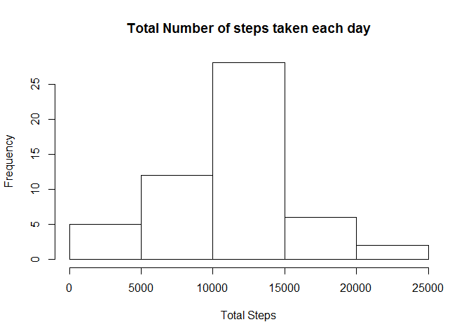
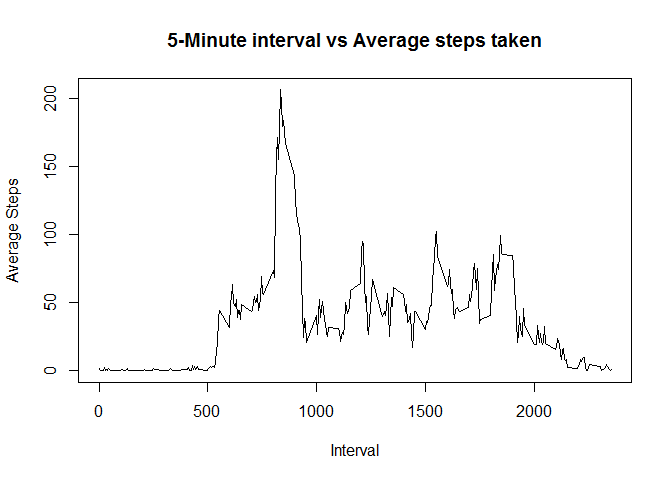
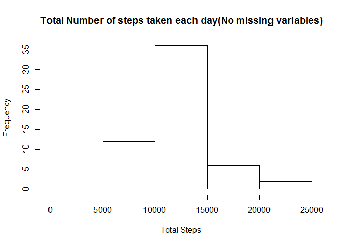
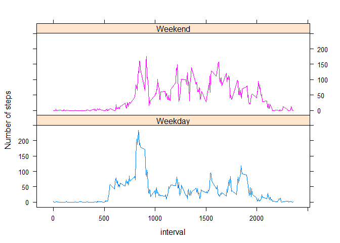

# Reproducible Research: Peer Assessment 1

## Loading and preprocessing the data
###Show any code that is needed to


###### 1. Load the data (i.e. "read.csv())" 


```r
library(dplyr)
```

```
## 
## Attaching package: 'dplyr'
## 
## The following objects are masked from 'package:stats':
## 
##     filter, lag
## 
## The following objects are masked from 'package:base':
## 
##     intersect, setdiff, setequal, union
```

```r
library(lubridate)
activity <- read.csv(unz("activity.zip", "activity.csv"))
```
 
###### 2. Process/transform the data (if necessary) into a format suitable for your analysis


## What is mean total number of steps taken per day?


```r
mean_by_date <- summarise(group_by(activity, date), mean(steps))
names(mean_by_date)[2]<- "mean_total_steps"
```

######For this part of the assignment, you can ignore the missing values in the dataset.

######    Create a new variable activity_no_na and remove values with NA from the steps variable.

```r
activity_no_na <- subset(activity, !is.na(steps ))
```

###### 1 Make a histogram of the total number of steps taken each day

```r
sum_by_date <- summarise(group_by(activity, date), sum(steps))
names(sum_by_date)[2]<- "total_steps"
hist(sum_by_date$total_steps,main="Total Number of steps taken each day",xlab="Total Steps")
```

 

###### 2 Calculate and report the mean and median total number of steps taken per day

```r
sum_by_date <- summarise(group_by(activity_no_na, date), sum(steps))
names(sum_by_date)[2]<- "total_steps"
mean<- mean(sum_by_date$total_steps)
median<-median(sum_by_date$total_steps)
```

The mean is 1.0766 &times; 10<sup>4</sup> and the median is 10765.

## What is the average daily activity pattern?

######1. Make a time series plot (i.e. type = "l") of the 5-minute interval (x-axis) and the average number of steps taken, averaged across all days (y-axis)

```r
average_daily <- summarise(group_by(activity_no_na, interval), mean(steps))
names(average_daily)[2]<- "Average"
plot(average_daily$interval,average_daily$Average, xlab="Interval",ylab="Average Steps",main="5-Minute interval vs Average steps taken", type = "l")
```

 

######2. Which 5-minute interval, on average across all the days in the dataset, contains the maximum number of steps?

```r
maximum<-max(average_daily$Average)
mi<-subset(average_daily ,Average == maximum)
```

The 5-min interval which contains the maximum number of stes, on average accross all days in the dataset is : 835

## Imputing missing values

###### Note that there are a number of days/intervals where there are missing values (coded as NA). The presence of missing days may introduce bias into some calculations or summaries of the data.


###### 1. Calculate and report the total number of missing values in the dataset (i.e. the total number of rows with NAs)

```r
missing <- subset(activity, is.na(steps))
len<-length(missing$steps)
```

The total number of missing values in the dataset is: 2304.


######2. Devise a strategy for filling in all of the missing values in the dataset. The strategy does not need to be sophisticated. For example, you could use the mean/median for that day, or the mean for that 5-minute interval, etc.

Here I have decided to use the average steps taken for each interval to fill in missing data for an interval.
In order to do this, using the already calculated data above, acitivty_daily this is merged with the original dataset activity
and joined by interval. 

A new column called stepsfill is created. Looping through the lenghth of the dataset, here  length of steps has been used to get the number,  the values are checked if is.na is true. If it is value is updated with the average for the interval which was already stored in the average column


######3. Create a new dataset that is equal to the original dataset but with the missing data filled in.

```r
df <-merge(activity, average_daily, by.x="interval", by.y="interval")
df<-mutate(df, stepsfill= steps)

for (i in 1:length(df$steps))
  if(is.na(df$steps[i])){df$stepsfill[i]=df$Average[i]}
```

######4. Make a histogram of the total number of steps taken each day and Calculate and report the mean and median total number of steps taken per day. Do these values differ from the estimates from the first part of the assignment? What is the impact of imputing missing data on the estimates of the total daily number of steps?

```r
sum_by_date <- summarise(group_by(df, date), sum(stepsfill))
names(sum_by_date)[2]<- "total_steps"
hist(sum_by_date$total_steps,main="Total Number of steps taken each day(No missing variables)",xlab="Total Steps")
```

 

```r
mean<- mean(sum_by_date$total_steps)
median<-median(sum_by_date$total_steps)
```
The mean is 1.0766 &times; 10<sup>4</sup> and the median is 1.0766 &times; 10<sup>4</sup>. 


## Are there differences in activity patterns between weekdays and weekends?
######For this part the weekdays() function may be of some help here. Use the dataset with the filled-in missing values for this part.


######1. Create a new factor variable in the dataset with two levels – “weekday” and “weekend” indicating whether a given date is a weekday or weekend day.

```r
df <- mutate(df,weekday=  wday(as.Date(df$date)) )

for (i in 1:length(df$weekday))   
      {
        if (df$weekday[i] == 1 | df$weekday[i]== 7)
          { df$weekday[i]="Weekend"
           }
        if( df$weekday[i] ==2 | df$weekday[i]==3 | df$weekday[i]==4| df$weekday[i]==5| df$weekday[i]==6 )
          {df$weekday[i]="Weekday" 
           }
           }   
 df$weekday <- as.factor(df$weekday)
```

######2. Make a panel plot containing a time series plot (i.e. type = "l") of the 5-minute interval (x-axis) and the average number of steps taken, averaged across all weekday days or weekend days (y-axis). The plot should look something like the following, which was creating using simulated data:

```r
library(lattice)
avg <- summarise(group_by(df,interval,weekday),mean(steps, na.rm = TRUE))
names(avg)[3]<- "Average"

xyplot(Average ~ interval|weekday,type="l",avg, groups= weekday,layout=c(1,2), ylab="Number of steps")
```

 

#####There are differences in the average number of steps taken across weekdays and weekends
